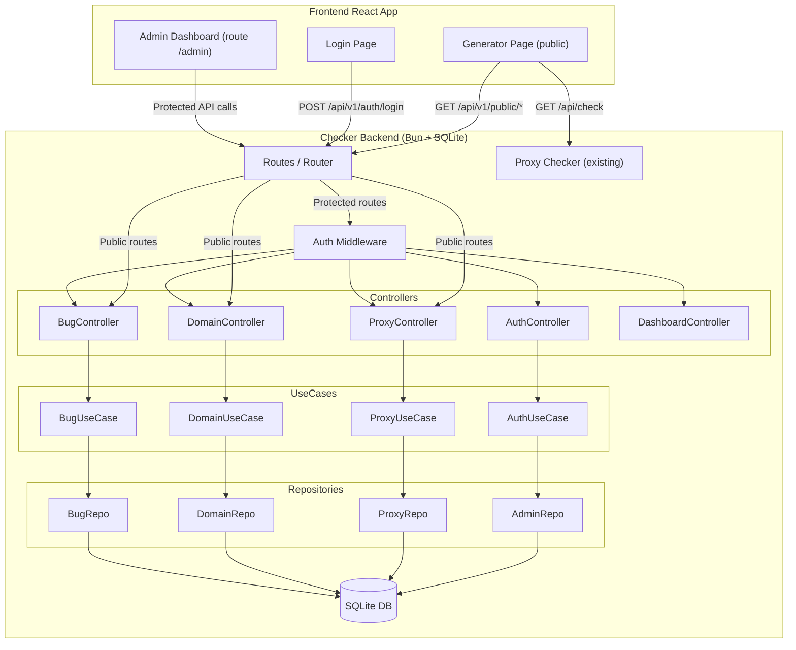

# Admin Dashboard Backend — Clean Architecture dengan Bun + SQLite

## Background

Saat ini, data konfigurasi frontend (`proxyip.json`, `domain.json`, `bug_list.json`) di-hardcode sebagai static JSON files di `/public/` dan di-reference via URL di `src/utils/config.ts`. Perubahan data memerlukan commit ke GitHub lalu frontend fetch dari raw GitHub URL.

**Goal**: Membangun Admin Dashboard backend di dalam folder `checker/` yang sudah ada (Bun runtime), dilengkapi:
1. **Autentikasi login admin** (JWT-based) — single admin only
2. **CRUD management** untuk Proxy IP, Domain, dan Bug List
3. **SQLite** sebagai database (via `bun:sqlite`)
4. **Clean Architecture** (Repository → UseCase → Controller → Routes)
5. **API endpoint** untuk frontend menggantikan static JSON files
6. **Admin Dashboard UI** sebagai route `/admin` di React app existing

---

## Keputusan Desain (Resolved)

| # | Pertanyaan | Keputusan |
|---|-----------|-----------|
| 1 | Multi-user admin? | **Tidak** — cukup 1 admin saja, tanpa fitur register |
| 2 | Data migration? | **Ya** — auto-import data dari `proxyip.json`, `domain.json`, `bug_list.json` ke SQLite saat pertama kali seed |
| 3 | Dashboard UI? | **Route `/admin`** di React app existing (satu codebase, lebih simpel) |

---

## Catatan Penting

> [!IMPORTANT]
> **Breaking Change pada Frontend**: Setelah backend aktif, `config.ts` akan di-update agar fetch data dari API backend (`/api/v1/public/proxies`, `/api/v1/public/domains`, `/api/v1/public/bugs`) alih-alih dari static JSON / raw GitHub URL. Frontend perlu di-rebuild.

> [!WARNING]
> **Default Admin Credentials**: Admin pertama akan di-seed saat pertama kali server start dengan username `admin` dan password `admin123`. Harap segera diganti setelah deploy.

---

## Proposed Changes

### Part 1: Backend (Clean Architecture di `checker/`)

#### Struktur Folder

```
checker/
├── index.ts                     # Entry point, server bootstrap
├── package.json                 # Dependencies (tambah jose)
├── config.json                  # Local configuration with secrets (git ignored)
├── config.example.json          # Configuration template
├── PRD.md                       # Dokumen ini
├── Dockerfile                   # Docker config
├── database/
│   ├── database.ts              # SQLite connection & table initialization
│   └── seed.ts                  # Seed admin + import JSON data existing
├── src/
│   ├── models/                  # Entity / Domain Models
│   │   ├── Admin.ts
│   │   ├── ProxyIP.ts
│   │   ├── Domain.ts
│   │   └── Bug.ts
│   ├── repositories/            # Data Access Layer (SQLite queries)
│   │   ├── AdminRepository.ts
│   │   ├── ProxyRepository.ts
│   │   ├── DomainRepository.ts
│   │   └── BugRepository.ts
│   ├── usecases/                # Business Logic Layer
│   │   ├── AuthUseCase.ts
│   │   ├── ProxyUseCase.ts
│   │   ├── DomainUseCase.ts
│   │   └── BugUseCase.ts
│   ├── controllers/             # HTTP Handler / Controller
│   │   ├── AuthController.ts
│   │   ├── ProxyController.ts
│   │   ├── DomainController.ts
│   │   └── BugController.ts
│   ├── middlewares/
│   │   └── authMiddleware.ts    # JWT auth middleware
│   ├── routes/
│   │   └── index.ts             # Central router
│   └── utils/
│       ├── response.ts          # Standard JSON response builder
│       ├── password.ts          # Bun.password hash & verify
│       └── jwt.ts               # JWT sign & verify (jose)
└── data/
    └── admin.db                 # SQLite database file (gitignored)
```

---

#### Database Layer

##### [NEW] database/database.ts
- Inisialisasi SQLite via `bun:sqlite` (native, zero-dependency)
- Create tables: `admins`, `proxies`, `domains`, `bugs`
- WAL mode untuk performa

```sql
-- admins (single admin)
CREATE TABLE IF NOT EXISTS admins (
  id INTEGER PRIMARY KEY AUTOINCREMENT,
  username TEXT UNIQUE NOT NULL,
  password TEXT NOT NULL,
  created_at TEXT DEFAULT (datetime('now')),
  updated_at TEXT DEFAULT (datetime('now'))
);

-- proxies (mirror proxyip.json structure)
CREATE TABLE IF NOT EXISTS proxies (
  id INTEGER PRIMARY KEY AUTOINCREMENT,
  proxy TEXT NOT NULL,
  port TEXT DEFAULT '443',
  proxyip INTEGER DEFAULT 1,
  ip TEXT NOT NULL,
  latency INTEGER DEFAULT 0,
  asn INTEGER,
  as_organization TEXT,
  colo TEXT,
  country TEXT,
  city TEXT,
  region TEXT,
  postal_code TEXT,
  latitude TEXT,
  longitude TEXT,
  is_active INTEGER DEFAULT 1,
  created_at TEXT DEFAULT (datetime('now')),
  updated_at TEXT DEFAULT (datetime('now'))
);

-- domains
CREATE TABLE IF NOT EXISTS domains (
  id INTEGER PRIMARY KEY AUTOINCREMENT,
  domain TEXT UNIQUE NOT NULL,
  is_active INTEGER DEFAULT 1,
  created_at TEXT DEFAULT (datetime('now'))
);

-- bugs
CREATE TABLE IF NOT EXISTS bugs (
  id INTEGER PRIMARY KEY AUTOINCREMENT,
  hostname TEXT UNIQUE NOT NULL,
  is_active INTEGER DEFAULT 1,
  created_at TEXT DEFAULT (datetime('now'))
);
```

##### [NEW] database/seed.ts
- Seed admin default: username `admin`, password `admin123` (hashed via `Bun.password.hash` Argon2id)
- **Auto-import** data dari JSON files:
  - Baca `../public/proxyip.json` → insert ke tabel `proxies`
  - Baca `../public/domain.json` → insert ke tabel `domains`
  - Baca `../public/bug_list.json` → insert ke tabel `bugs`
- Skip import jika tabel sudah memiliki data (prevent duplicate)

---

#### Models

##### [NEW] src/models/Admin.ts
```typescript
export interface Admin {
  id: number;
  username: string;
  password: string;
  created_at: string;
  updated_at: string;
}
```

##### [NEW] src/models/ProxyIP.ts
```typescript
export interface ProxyIP {
  id: number;
  proxy: string;
  port: string;
  proxyip: boolean;
  ip: string;
  latency: number;
  asn: number | null;
  as_organization: string | null;
  colo: string | null;
  country: string | null;
  city: string | null;
  region: string | null;
  postal_code: string | null;
  latitude: string | null;
  longitude: string | null;
  is_active: boolean;
  created_at: string;
  updated_at: string;
}
```

##### [NEW] src/models/Domain.ts
```typescript
export interface Domain {
  id: number;
  domain: string;
  is_active: boolean;
  created_at: string;
}
```

##### [NEW] src/models/Bug.ts
```typescript
export interface Bug {
  id: number;
  hostname: string;
  is_active: boolean;
  created_at: string;
}
```

---

#### Repositories (Data Access Layer)

Semua repository menggunakan `bun:sqlite` prepared statements untuk keamanan & performa.

##### [NEW] src/repositories/AdminRepository.ts
- `findByUsername(username: string): Admin | null`
- `findById(id: number): Admin | null`
- `updatePassword(id, newHashedPassword): void`

> Tidak ada `create()` karena admin hanya 1, di-seed saat startup.

##### [NEW] src/repositories/ProxyRepository.ts
- `findAll(page, limit, filters): { data: ProxyIP[], total: number }`
- `findById(id): ProxyIP | null`
- `create(proxy): ProxyIP`
- `update(id, proxy): ProxyIP`
- `delete(id): void`
- `bulkCreate(proxies[]): number` — bulk insert, return jumlah inserted
- `getPublicList(): object[]` — format output sama persis seperti `proxyip.json`
- `count(): number` — total count untuk dashboard stats

##### [NEW] src/repositories/DomainRepository.ts
- `findAll(): Domain[]`
- `create(domain): Domain`
- `delete(id): void`
- `getPublicList(): string[]` — format output sama persis seperti `domain.json`
- `count(): number`

##### [NEW] src/repositories/BugRepository.ts
- `findAll(): Bug[]`
- `create(hostname): Bug`
- `delete(id): void`
- `getPublicList(): string[]` — format output sama persis seperti `bug_list.json`
- `count(): number`

---

#### UseCases (Business Logic)

##### [NEW] src/usecases/AuthUseCase.ts
- `login(username, password)` → validate credentials, return JWT token
- `verifyToken(token)` → decode & verify JWT
- `changePassword(adminId, oldPassword, newPassword)`
- `getProfile(adminId)` → return admin info (tanpa password)

##### [NEW] src/usecases/ProxyUseCase.ts
- `getAllProxies(page, limit, filters)` — paginated, bisa filter by country/active
- `createProxy(data)` — validasi input
- `updateProxy(id, data)`
- `deleteProxy(id)`
- `importFromJSON(jsonData[])` — bulk import
- `getPublicProxyList()` — response format kompatibel dengan frontend existing

##### [NEW] src/usecases/DomainUseCase.ts
- `getAllDomains()` — list semua domain
- `createDomain(domain)` — validasi duplikasi
- `deleteDomain(id)`
- `getPublicDomainList()` — return `string[]`

##### [NEW] src/usecases/BugUseCase.ts
- `getAllBugs()` — list semua bug hostname
- `createBug(hostname)` — validasi duplikasi
- `deleteBug(id)`
- `getPublicBugList()` — return `string[]`

---

#### Controllers (HTTP Handlers)

##### [NEW] src/controllers/AuthController.ts

| Method | Endpoint | Auth | Description |
|--------|----------|------|-------------|
| POST | `/api/v1/auth/login` | ❌ | Login, return JWT |
| GET | `/api/v1/auth/me` | ✅ | Get current admin info |
| PUT | `/api/v1/auth/password` | ✅ | Change password |

##### [NEW] src/controllers/ProxyController.ts

| Method | Endpoint | Auth | Description |
|--------|----------|------|-------------|
| GET | `/api/v1/proxies` | ✅ | List proxies (paginated) |
| POST | `/api/v1/proxies` | ✅ | Add proxy |
| PUT | `/api/v1/proxies/:id` | ✅ | Update proxy |
| DELETE | `/api/v1/proxies/:id` | ✅ | Delete proxy |
| POST | `/api/v1/proxies/import` | ✅ | Bulk import from JSON |
| GET | `/api/v1/public/proxies` | ❌ | Public list (pengganti proxyip.json) |

##### [NEW] src/controllers/DomainController.ts

| Method | Endpoint | Auth | Description |
|--------|----------|------|-------------|
| GET | `/api/v1/domains` | ✅ | List all domains |
| POST | `/api/v1/domains` | ✅ | Add domain |
| DELETE | `/api/v1/domains/:id` | ✅ | Delete domain |
| GET | `/api/v1/public/domains` | ❌ | Public list (pengganti domain.json) |

##### [NEW] src/controllers/BugController.ts

| Method | Endpoint | Auth | Description |
|--------|----------|------|-------------|
| GET | `/api/v1/bugs` | ✅ | List all bugs |
| POST | `/api/v1/bugs` | ✅ | Add bug hostname |
| DELETE | `/api/v1/bugs/:id` | ✅ | Delete bug |
| GET | `/api/v1/public/bugs` | ❌ | Public list (pengganti bug_list.json) |

##### [NEW] src/controllers/DashboardController.ts

| Method | Endpoint | Auth | Description |
|--------|----------|------|-------------|
| GET | `/api/v1/dashboard/stats` | ✅ | Statistik: total proxy, domain, bug |

---

#### Middlewares

##### [NEW] src/middlewares/authMiddleware.ts
- Extract `Authorization: Bearer <token>` header
- Verify JWT via `jose`
- Return admin info jika valid, atau `null` jika tidak
- Controller yang protected akan cek result dan return `401` jika `null`

---

#### Utilities

##### [NEW] src/utils/response.ts
```typescript
// Standard response format
{ success: true, message: "...", data: {...} }
{ success: false, message: "Error message", error: "..." }

// Paginated response
{ success: true, data: [...], pagination: { page, limit, total, totalPages } }
```

##### [NEW] src/utils/password.ts
- `hashPassword(plain)` → `Bun.password.hash(plain, { algorithm: "argon2id" })`
- `verifyPassword(plain, hash)` → `Bun.password.verify(plain, hash)`

##### [NEW] src/utils/jwt.ts
- `signToken(payload)` → JWT signed with HS256 via `jose`
- `verifyToken(token)` → decoded payload or throw
- Token expiry: configurable via env `JWT_EXPIRES_IN` (default `24h`)

---

#### Routes

##### [NEW] src/routes/index.ts
- Central router yang menggabungkan semua controller
- Pattern matching pada `url.pathname` + `request.method`
- Apply auth middleware untuk protected routes (`/api/v1/*` kecuali `/api/v1/public/*` dan `/api/v1/auth/login`)

---

#### Entry Point

##### [MODIFY] index.ts
- Import database initialization & seed
- Import router dari `src/routes`
- Tambahkan CORS handling (OPTIONS preflight) untuk semua `/api/` routes
- Routing priority:
  1. `/health` & `/` → health check (existing)
  2. `/api/check` → proxy checker (existing)
  3. `/api/v1/*` → admin API router (NEW)
  4. `404` fallback
- Jalankan database init + seed saat startup

---

#### Config & Dependencies

##### [MODIFY] package.json
```json
{
  "dependencies": {
    "jose": "^6.0.0"
  },
  "scripts": {
    "start": "bun run index.ts",
    "dev": "bun run --watch index.ts",
    "seed": "bun run database/seed.ts"
  }
}
```

##### [NEW] config.example.json
```json
{
  "port": 4002,
  "jwt": {
    "secret": "generate-a-secure-random-secret-key-32-chars-minimum",
    "expiresIn": "24h"
  },
  "admin": {
    "username": "admin",
    "password": "admin123"
  }
}
```

---

### Part 2: Frontend Admin Dashboard (Route `/admin`)

Dashboard admin ditambahkan ke React app existing sebagai route baru.

#### File Baru di Frontend

##### [NEW] src/pages/admin/Login.tsx
- Form login (username + password)
- Kirim POST ke `/api/v1/auth/login`
- Simpan JWT token di `localStorage`
- Redirect ke `/admin/dashboard` setelah login sukses

##### [NEW] src/pages/admin/Dashboard.tsx
- Halaman utama admin setelah login
- Tampilkan statistik: total Proxy IP, Domain, Bug
- Card layout dengan angka besar + icon

##### [NEW] src/pages/admin/ProxyManagement.tsx
- Tabel list proxy (paginated)
- Fitur: Add, Edit, Delete proxy
- Tombol Import JSON (upload file / paste JSON)
- Filter by country, status active/inactive

##### [NEW] src/pages/admin/DomainManagement.tsx
- List domain + Add/Delete
- Simple table layout

##### [NEW] src/pages/admin/BugManagement.tsx
- List bug hostname + Add/Delete
- Simple table layout

##### [NEW] src/pages/admin/Settings.tsx
- Change password form

##### [NEW] src/components/admin/AdminLayout.tsx
- Layout khusus admin dengan sidebar navigasi
- Menu items: Dashboard, Proxy IP, Domain, Bug List, Settings
- Header dengan info admin + tombol logout

##### [NEW] src/components/admin/ProtectedRoute.tsx
- Wrapper component yang cek JWT token di localStorage
- Redirect ke `/admin/login` jika tidak authenticated
- Verify token via `GET /api/v1/auth/me`

##### [NEW] src/utils/adminApi.ts
- Helper untuk API calls ke backend admin
- Auto-attach `Authorization: Bearer <token>` header
- Handle 401 response → redirect ke login

#### File yang Dimodifikasi

##### [MODIFY] src/App.tsx
- Tambah routes:
  - `/admin/login` → Login page
  - `/admin/*` → Protected admin routes (Dashboard, Proxy, Domain, Bug, Settings)

---

### Part 3: Infrastructure Updates

##### [MODIFY] ../nginx.conf
- Tambah reverse proxy untuk API v1:
```nginx
# Admin API reverse proxy
location /api/v1/ {
    proxy_pass http://lufeng-checker:4002/api/v1/;
    proxy_set_header Host $host;
    proxy_set_header X-Real-IP $remote_addr;
    proxy_set_header X-Forwarded-For $proxy_add_x_forwarded_for;
}
```

##### [MODIFY] ../src/utils/config.ts
- Update default URL:
```typescript
proxyListUrl: import.meta.env.VITE_PROXY_LIST_URL || "/api/v1/public/proxies",
domainListUrl: import.meta.env.VITE_DOMAIN_LIST_URL || "/api/v1/public/domains",
bugListUrl: import.meta.env.VITE_BUG_LIST_URL || "/api/v1/public/bugs",
```

##### [MODIFY] ../.gitignore
- Tambah: `checker/data/*.db`

##### [MODIFY] checker/Dockerfile
- Tambah `COPY package.json bun.lock* ./` dan `RUN bun install`
- Tambah volume hint untuk `/app/data`

##### [MODIFY] ../docker/docker-compose.yml
- Tambah volume mount: `${APP_PATH}/data:/app/data`
- Tambah environment variables:
```yaml
environment:
  - JWT_SECRET=${JWT_SECRET}
  - ADMIN_USERNAME=${ADMIN_USERNAME:-admin}
  - ADMIN_PASSWORD=${ADMIN_PASSWORD:-admin123}
```

---

## Flow Diagram



---

## Execution Order

Urutan implementasi yang optimal:

### Phase 1: Backend Core
1. Database layer (`database.ts`, `seed.ts`)
2. Models (semua interface)
3. Utils (`password.ts`, `jwt.ts`, `response.ts`)
4. Repositories (semua)
5. UseCases (semua)
6. Middlewares (`authMiddleware.ts`)
7. Controllers (semua)
8. Routes (`index.ts`)
9. Update entry point (`checker/index.ts`)
10. Update `package.json` & install `jose`

### Phase 2: Frontend Admin Dashboard
1. `adminApi.ts` (API helper)
2. `ProtectedRoute.tsx` (auth guard)
3. `AdminLayout.tsx` (sidebar + header)
4. Login page
5. Dashboard page (stats)
6. Proxy Management page (CRUD + import)
7. Domain Management page
8. Bug Management page
9. Settings page (change password)
10. Update `App.tsx` (routing)

### Phase 3: Integration & Config
1. Update `config.ts` (frontend URL)
2. Update `nginx.conf`
3. Update `Dockerfile` & `docker-compose.yml`
4. Update `.gitignore`

---

## Verification Plan

### Automated Tests
```bash
# 1. Install backend dependencies
cd checker && bun install

# 2. Start backend server
bun run dev

# 3. Test health endpoint
curl http://localhost:4002/health

# 4. Test login
curl -X POST http://localhost:4002/api/v1/auth/login \
  -H "Content-Type: application/json" \
  -d '{"username":"admin","password":"admin123"}'

# 5. Test protected endpoint (with token from step 4)
curl http://localhost:4002/api/v1/proxies \
  -H "Authorization: Bearer <token>"

# 6. Test public endpoints (format harus sama dengan JSON files existing)
curl http://localhost:4002/api/v1/public/proxies
curl http://localhost:4002/api/v1/public/domains
curl http://localhost:4002/api/v1/public/bugs

# 7. Verify existing proxy checker masih jalan
curl "http://localhost:4002/api/check?ips=1.1.1.1:443"

# 8. Start frontend
cd .. && bun run dev
# Buka browser → /#/admin → harus redirect ke login
```

### Manual Verification
- Login dengan `admin` / `admin123` → dapat JWT token
- Dashboard menampilkan statistik yang benar
- CRUD proxy, domain, bug berfungsi
- Public endpoint format output sama persis dengan JSON files existing
- Existing `/api/check` proxy checker masih berfungsi normal
- Auto-import: data dari JSON files muncul di dashboard setelah pertama kali seed
